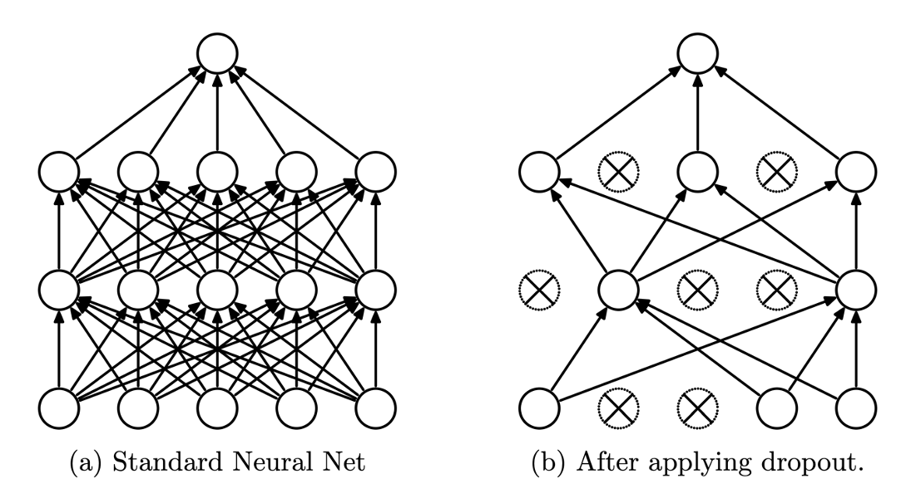

* TOC
{:toc}

{:#정규화}
# 정규화 (_Regularization_)
만약 모델에서 높은 분산으로 인한 과적합 문제가 발생한 것이 의심된다면 가장 먼저 시도해보아야 할 것은 정규화(_Regularization_)이다. 더 많은 데이터를 얻는 것도 문제를 해결해줄 수 있지만 더 많은 데이터를 구하기 힘든 상황이 많고 더 많은 데이터는 학습에 소모되는 비용을 증가시키기 때문이다.

로지스틱 회귀를 이용해 정규화의 개념을 이해해보자. 로지스틱회귀는 다음과 같은 비용함수 $J$ 를 최소화함으로써 학습한다. 

$$
w \in \mathbb{R}^{n_x},\ b \in \mathbb{R}
$$

$$
\begin{array}{l}
\min\limits_{w,\ b} J(w,\ b)\\
J(w,\ b) = \frac{1}{m} \sum\limits_{i = 1}^m \mathcal{L} (\hat y^{(i)},\ y^{(i)})
\end{array}
$$

여기에 정규화를 하기 위해서는 정규화 매개변수(_Regularization Parameter_)라고 부르는 $\lambda$ 와 노름(_norm_)의 제곱의 곱을 더해야 한다. 따라서 비용함수는 다음과 같다.

$$
J(w,\ b) = \frac{1}{m} \sum_{i = 1}^m \mathcal{L} (\hat y^{(i)},\ y^{(i)})\ +\ \frac{\lambda}{2m} {\lVert w \rVert}^2
$$

먼저 $L_2$ 정규화($L_2$ _Regularization_)에서 가중치 $w$ 노름의 제곱  ${\lVert w \rVert}^2_2$ 은 다음과 같다.

$$
{\lVert w \rVert}^2_2 = \sum_{j = 1}^{n_x} {w_j}^2 = w^T w
$$

보통 가중치의 노름과 정규화 매개변수의 곱만 더하고 편향의 노름과 정규화 매개변수의 곱은 더하지 않고 생략한다. 왜냐하면 가중치 $w$ 는 매우 높은 차원의 벡터이고 편향 $b$ 는 스칼라이기 때문이다. 가중치는 매우 높은 차원의 벡터이므로 거의 모든 매개변수는 $w$ 에 존재한다. 따라서 편향의 노름의 제곱(= 편향의 제곱)을 더하는 것은 거의 아무런 변화도 가져오지 않는다. 따라서 보통 편향은 더하지 않는다. 

다른 정규화 방법인 $L_1$ 정규화($L_1$ _Regularization_)는 다음과 같은 식을 대신 더한다. 

$$
\frac{\lambda}{2m} \sum_{j = 1}^{n_x} {\vert w \vert}_1 = \frac{\lambda}{2m} {\lVert w \rVert}
$$

$L_1$ 정규화를 사용하면 $w$ 는 희소(_sparse_)해지는데, 이는 벡터 $w$ 안에 0이 많아진다는 뜻이다. 어떤 사람들은 이것이 모델을 압축하는데 도움이 된다고 말한다. 왜냐하면 파라미터 안에 0이 많아지면 메모리를 적게 차지하기 때문이다. 그러나 모델을 압축하겠다는 목표가 있지 않는 이상 $L_1$ 정규화는 잘 사용되지 않는다. 대신 $L_2$ 정규화를 많이 사용한다.

정규화 매개변수 $\lambda$ 는 개발세트나 교차검증세트를 사용하여 다양한 값을 대입해보면서 데이터셋에 맞는 적절한 값을 선택한다. 그러므로 $\lambda$ 는 설정이 필요한 또 다른 하이퍼파라미터임을 확인할 수 있다. 

앞서 로지스틱 회귀에서의 정규화를 확인해보았다. 정규화를 적용한 신경망의 비용함수는 다음과 같이 정의된다.

$$
J(w^{[1]},\ b^{[1]},\ \cdots, w^{[L]},\ b^{[L]}) = \frac{1}{m} \sum^{m}_{i = 1} \mathcal{L} (\hat y^{(i)},\ y^{(i)}) +\ \frac{\lambda}{2m} \sum_{l=1}^L {\lVert W^{[l]} \rVert}^2_F
$$

그리고 각 행렬의 노름의 제곱 ${\lVert w^{[l]} \rVert}^2$ 은 다음과 같다.

$$
{\lVert w^{[l]} \rVert}^2_F = \sum_{i=1}^{n^{[l-1]}} \sum_{j=1}^{n^{[l]}} {\left( W_{ij}^{[l]} \right)}^2
\ \ \left(\because\ w: n^{[l-1]} \times n^{[l]} \right)
$$

이를 프로베니우스 노름(_Frobenius Norm_)이라고 한다. 프로베니우스 노름을 표현할 때는 위 식처럼 아래 첨자에 $F$ 를 표시한다. 

이러한 식에서 역전파를 구하는 법을 알아보자. 앞서 우리는 역전파를 다음과 같이 구현했다.

$$
\begin{aligned}
dw^{[l]} &= \frac{\partial J}{\partial w^{[l]}}\\
w^{[l]} &:= w^{[l]} - \alpha \ dw^{[l]}
\end{aligned}
$$

정규화를 적용한 식에서는 다음과 같이 계산한다.

$$
\begin{aligned}
dw^{[l]} &= \frac{\partial J}{\partial w^{[l]}} + \frac{\lambda}{m} w^{[l]}\\
w^{[l]} &:= w^{[l]} - \alpha \ dw^{[l]}
\end{aligned}
$$

이와 같은 식으로 인해 $L_2$ 정규화는 가중치 감쇠(_Weight Decay_)라고도 불린다. 왜냐하면  정규화를 적용하지 않을 때보다 적용할 때 가중치가 더 많이 줄더들면서 갱신되기 때문이다. $w^{[l]}$ 의 어떤 원소가 양수일 때는 더 큰 값을 빼는 방식으로 가중치가 갱신되고, 음수일 때는 더 작은 값을 빼는 방식으로 가중치가 갱신되므로, 벡터 원소의 값의 크기(= 절대값)는 정규화를 적용했을 때 더 줄어들기 때문이다. 

{:#정규화와 과적합}
# 정규화와 과적합
정규화는 분산을 감소시키고 결과적으로 과적합을 막는다. 어떻게 그럴 수 있는 것일까? 먼저 과적합이 왜 발생하는지를 생각해보자. 과적합은 모델이 훈련 데이터에 과도하게 맞는 것이다. 딥러닝은 많은 파라미터를 가지는 복잡한 모델을 설계할 수 있다. 그래서 매우 복잡한 데이터를 학습할 수 있는데, 이는 반대로 훈련 데이터에 과도할 정도로 딱 들어맞게 학습하여 과적합이 발생하기 쉬움을 의미한다.

이제 다음의 정규화 식을 살펴보자.

$$
J(w^{[1]},\ b^{[1]},\ \cdots, w^{[L]},\ b^{[L]}) = \frac{1}{m} \sum^{m}_{i = 1} \mathcal{L} (\hat y^{(i)},\ y^{(i)}) +\ \frac{\lambda}{2m} \sum_{l=1}^L {\lVert W^{[l]} \rVert}^2_F
$$

이 식을 통해 알 수 있는 것은 정규화 파라미터 $\lambda$ 를 큰 값으로 설정하면 가중치 $w^{[l]}$ 이 0에 가까워진다는 것( $w^{[l]} \approx 0$ )이다. 이는 많은 은닉 유닛의 출력값이 0에 가까운 값으로 출력되게 해서 많은 은닉 유닛의 영향력을 줄이는 결과를 낳는다. 많은 은닉유닛이 거의 항상 비활성화된다는 것이다. 결과적으로 신경망은 훨씬 더 작고 간단해질 것이다. 신경망이 작고 간단해지면 모델이 훈련 데이터에 과도할 정도로 들어맞게 학습할 수 없어 과적합을 막을 수 있다. 

또 많은 활성화 함수 $g: x \mapsto g(x)$ 에 대해 $g$ 는 $x \approx 0 \Rightarrow g(x) \approx x$ ($x$ 가 0에 근사하면 $g$ 는 $y = x$ 에 근사)인 성질을 가지고 있다. 따라서 파라미터가 0에 가깝게 학습이 된다면 활성화함수는 선형이 되고, 이는 이전 포스트에서 증명했듯이 두 개 이상의 은닉층이 하나의 은닉층이 되는 효과를 낳는다. 

{:#드롭아웃(_Drop-out_) 정규화}
# 드롭아웃(_Drop-out_) 정규화
$L_2$ 정규화 이외에 다른 강력한 정규화 기법으로는 드롭아웃 정규화가 있다. 드롭아웃은 신경망의 각 층에 노드를 삭제할 확률을 적용하는 것이다. 다음 그림을 보자.


출처: [링크](https://kh-kim.github.io/nlp_with_deep_learning_blog/docs/1-14-regularizations/04-dropout/)

그림의 (a)는 우리가 이전까지 배웠던 일반적인 신경망을, (b)는 드롭아웃이 적용되어 일부 노드가 삭제되었을 때의 신경망을 표현했다. 이 둘을 보면 드롭아웃이 적용되었을 때 신경망은 더 작고 간소화된다. 이 감소된 신경망에 하나의 데이터 샘플(혹은 미니배치와 같은 일정한 단위의 데이터 부분)을 이용해 역전파하여 학습을 시킨다. 그리고 다른 데이터 샘플에 대해 드롭아웃을 다시 적용해 일부 노드는 다시 살리거나 그대로 두고 다른 노드는 랜덤하게 삭제한 채로 데이터 샘플을 역전파시켜 학습을 한다. 얼핏 보기에는 이상해 보이지만 실제로는 잘 작동하는 기법이다.

예리한 독자들은 드롭아웃 정규화, $L_2$ 정규화 등을 왜 사용하는 지, 정규화가 공통적으로 구현하는 것이 무엇인지 확인했을 것이다. 바로 필요이상으로 거대한 신경망의 규모를 줄이는 것이다. 딥러닝 모델은 기존의 예측모델(선형회귀, SVM, 로지스틱 회귀 등)에 비해 거대한 모델이다. 여기서 거대함은 파라미터의 개수가 많다는 것이다. 딥러닝은 거대하기 때문에 기존의 예측모델로는 예측하기 힘든 것들을 예측할 수 있지만 그에 대한 반작용으로 과적합의 가능성도 더욱 커졌다. 그래서 정규화를 통해 거대한 모델을 단순화(=유효한 파라미터의 개수를 감소시켜)시켜 과적합을 해결한다. 이제 드롭아웃들의 구현을 살펴보자.

{:##역 드롭아웃 (_Inverted Drop-out_)}
## 역 드롭아웃 (_Inverted Drop-out_)
역 드롭아웃은 가장 일반적인 드롭아웃의 구현 기법이다. 다음은 역 드롭아웃의 구현 예시이다. 3개의 층으로 구성된 모델이고, `keep_prob`은 유닛이 유지될 확률이다. 

```python
'''
초기화 코드
'''

d3 = np.random.rand(a3.shape[0], a3.shape[1]) < keep_prob
a3 *= d3
a3 /= keep_prob
```

만약 유닛이 유지될 확률이 0.8이고 한 층의 유닛이 50개라면 평균적으로 10개의 유닛이 삭제될 것이다. 이때 $z^{[4]}$ 의 식은 다음과 같다.

$$
z^{[4]} = W^{[4]} a^{[3]} + b^{[4]}
$$

드롭아웃을 거쳤으므로 벡터 $a^{[3]}$ 의 원소의 합은 20%정도 줄었을 것이다. 이는 $z^{[4]}$ 의 기대값의 감소로 이어질 것이다. 그러므로 $a^{[3]}$ 의 기대값을 유지하기 위해서는 $a^{[3]}$ 의 0이 되지 않은 원소들의 합을 20% 증가시켜야 한다. 따라서 구현 코드의 마지막 줄 `a3 /= keep_prob` 에서 했던 것처럼 유지될 확률로 낮춰주어 $a^{[3]}$ 의 기대값을 유지시킨다. 후술하겠지만 역 드롭아웃 기법은 테스트를 쉽게 해준다. 이 역 드롭아웃 기법은 최근 가장 보편적인 드롭아웃 기법이다. 주의할 점은 매 훈련 샘플마다 `d3` 는 갱신되어야 한다는 것이다. `d3` 가 갱신되지 않는다면 매 샘플마다 삭제된 유닛, 유지되는 유닛이 일정하기 때문에 드롭아웃의 효과를 얻지 못한다. 

이제 역 드롭아웃이 테스트 시기에 어떤 효과를 가져오는 지 살펴보자. 피처 $X$ 에 대해 머신러닝을 다음과 같이 표현하겠다. 테스트에서는 드롭아웃을 사용하지 않는다. 

$$
\begin{aligned}
a^{[0]} &= X\\
z^{[1]} &= W^{[1]}a^{[0]} + b^{[1]}\\
a^{[1]} &= g^{[1]}\left(z^{[1]} \right)\\
z^{[2]} &= W^{[2]}a^{[1]} + b^{[2]}\\
a^{[2]} &= g^{[2]}\left(z^{[2]} \right)\\
\end{aligned}
$$

테스트 시기에는 드롭아웃을 사용하지 않는 이유는 테스트의 결과가 랜덤인 것은 좋지 않기 때문이다. 테스트에 드롭아웃을 적용하는 것은 노이즈만을 증가한다. 물론 드롭아웃을 테스트에 적용하고 여러번 시행하여 평균을 구하는 것도 방법이 될 수 있지만 이는 비효율적이고 결과적으로 드롭아웃을 적용하지 않은 테스트와 거의 비슷한 결과를 낸다. 테스트할 때는 드롭아웃을 적용하지 않기 때문에 훈련할 때처럼 `keep_prob`으로 나누어 스케일링을 할 필요가 없다. 

{:#드롭아웃의 이해}
# 드롭아웃의 이해
드롭아웃을 사용하는 첫번 째 관점은 더 작은 신경망을 사용하는 것처럼 작동하게 하고 결과적으로 정규화의 효과를 주는 것이다. 두번째 관점은 은닉층의 유닛이 이전 층의 피처에 의존하지 않게 하는 것이다. 이전 층의 출력을 받아 입력값으로 사용하는 한 은닉층의 유닛은 입력값으로 의미있는 값을 출력하도록 파라미터가 조정되어 훈련된다. 만약 이전 층에 드롭아웃이 적용된다면 랜덤하게 일부 일력값이 0이 될 것이므로, 은닉층의 유닛은 한 특정 피처(=입력값)에 의존할 수 없다. 즉, 특정 입력에 유난히 큰 가중치를 줄 수 없는 것이다. 만약 그렇게 설정된다면 드롭아웃으로 인해 큰 가중치가 부여된 피처가 0이 되었을 때 적절한 출력을 할 수 없기 때문이다. 그러므로 학습이 진행됨에 따라 한 은닉층의 유닛은 각 입력 피처에 대해 가중치를 적절히 배분할 것이고 이는 가중치 벡터의 노름을 줄이는 효과를 가져온다.

드롭아웃을 적용할 때 권장할 점은 노름이 클 것으로 예상되는 크기가 큰 가중치 행렬에는 유닛을 유지할 확률을 비교적 낮게, 규모가 작은 행렬에는 유지 확률을 높게 설정하는 것이다. 입력 피처의 개수가 많고 유닛의 층이 많은 가중치 행렬은 크기가 크고, 반대의 경우에는 가중치 행렬의 크기가 작다. 가중치 행렬의 크기가 크면 과적합이 발생할 가능성이 높으므로 유닛을 삭제할 확률을 높게 설정하여 과적합을 막는 것이 좋다. 반대로 가중치 행렬의 크기가 작은 층에서는 과적합이 발생할 가능성이 적으므로 유닛을 유지할 확률을 높여도 괜찮다. 특히 유닛의 개수가 한두개 인 것처럼 매우 작은 층에는 유닛을 유지할 확률을 1로 설정하는 것도 좋다. 왜냐하면 유닛의 절반 이상이 사라지면 오히려 학습에 장애가 생길 수 있기 때문이다. 

드롭아웃의 단점은 비용함수가 잘 정의되지 않는다는 것이다. 그래서 비용함수가 단조감소(_Monotonically Decreasing_)하지 않을 수 있다.

{:#다른 정규화 기법들}
# 다른 정규화 기법들
고양이 사진과 같은 데이터의 경우 추가 데이터를 얻기 힘들 때는 사진을 좌우반전, 확대시키는 등 다양한 편집 기법으로 데이터를 확보하는 것도 방법이 될 수 있다. 이는 새로운 추가 데이터를 얻는 것 만큼 좋은 효과를 주지는 못하지만 그래도 도움이 된다. 추가적인 비용을 거의 지출하지 않고도 추가 데이터를 얻는 좋은 방법이다. 

다른 방법으로 조기 종료하는 방법이 있다. 일반적으로 학습이 반복될 때마다 훈련 데이터셋에 대한 비용함수는 단조감소한다. 하지만 학습이 반복됨에 따라 훈련셋에 대한 비용은 감소하는 데에 반해 개발 데이터셋에 대한 비용함수는 증가할 수 있다. 이때 개발셋에 대한 비용함수가 증가하기 전에 미리 훈련을 종료하면 과적합이 심하지 않은 훈련 결과를 얻을 수 있다. 

하지만 이는 단점이 있다. 머신러닝에서 파라미터를 최적화하는 것과 과적합을 막는 것은 별개의 문제로 처리한다. 이를 직교화(_Orthogonalization_)라 한다. 조기 종료의 문제는 이 둘을 서로 종속된 하나의 문제로 바꿔버려 문제를 더 복잡하게 한다는 것이다. 과적합을 막기 위해 비용함수 값을 낮추는 것을 포기해야 하기 때문이다. 

> 본 노트는 Andrew Ng의 머신러닝 수업을 정리한 것임. 
> Andrew Ng, Machine learning lecture, [Youtube Link](https://www.youtube.com/playlist?list=PLkRLdi-c79HKEWoi4oryj-Cx-e47y_NcM)

> [이전 포스트](https://sol1archive.github.io/note/step2-1) | [다음 포스트](https://sol1archive.github.io/note/step2-3) 